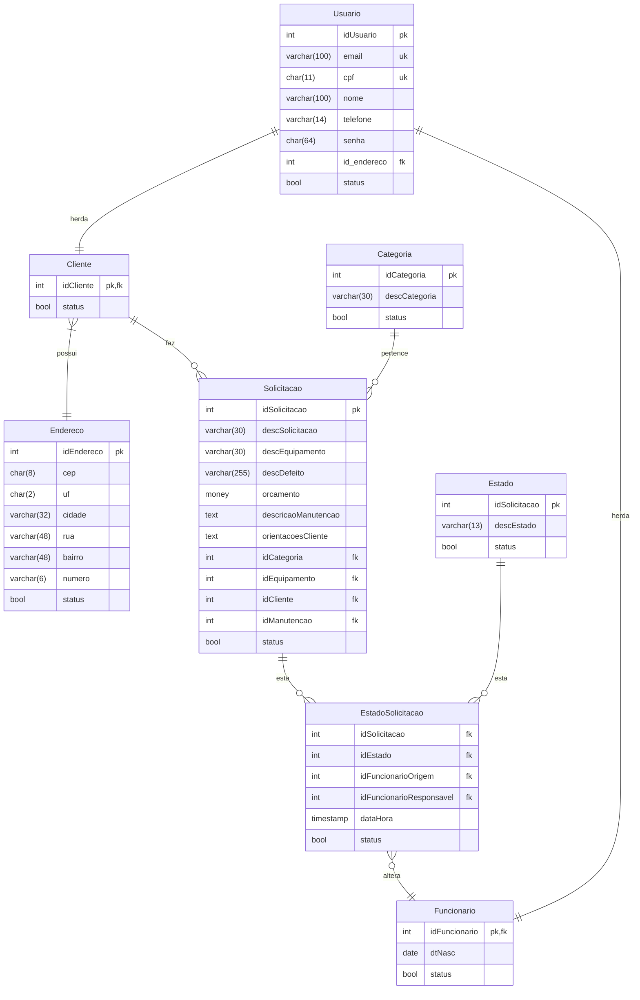

Tecnologia em Análise e Desenvolvimento de Sistemas

Setor de Educação Profissional e Tecnológica - SEPT

Universidade Federal do Paraná - UFPR

---

*DS140 - Desenvolvimento Web II*

Prof. Dr. Razer A. N. R. Montaño

# SRV-WEB2-UFPR-Trabalho-Final  
Projeto Back-End desenvolvido como trabalho final da disciplina de Desenvolvimento Web II do curso de Análise e Desenvolvimento de Sistemas

## Alunos
- Alisson Gabriel Santos [@AlissonGSantos](https://github.com/AlissonGSantos)
- Gabriel Alamartini Troni [@Gabriel-Troni](https://github.com/Gabriel-Troni)
- Leonardo Felipe Salgado [@Salgado2004](https://github.com/Salgado2004)
- Mateus Bazan Bespalhok [@Matbaaz](https://github.com/matbaaz)
- Pedro Henrique de Souza [@Pedro-H108](https://github.com/Pedro-H108)
- Raul Ferreira Costa Bana [@raulbana](https://github.com/raulbana)

## Modelo Relacional Do BD PostgreSQL

