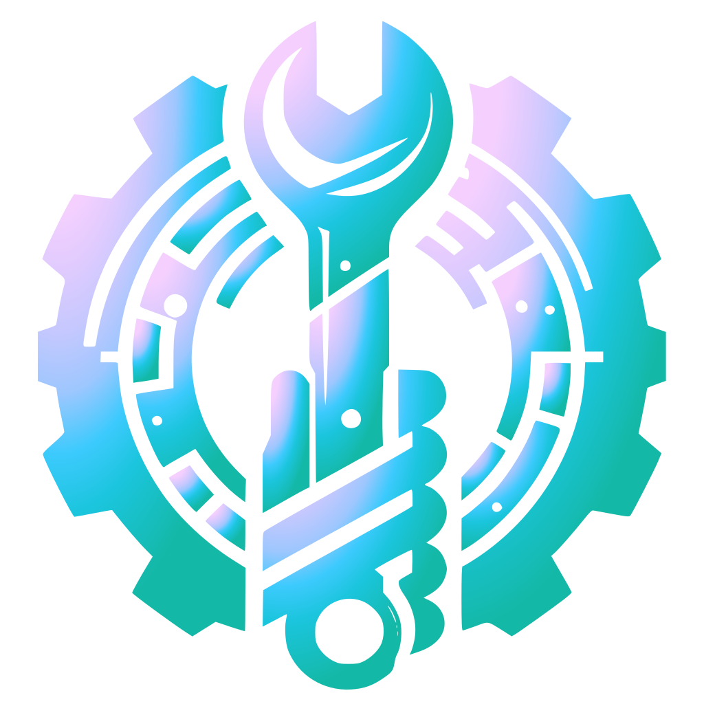

<h1 align="center" style="display: flex;">
  Project ManuTADS
  
</h1>

  
  
  
  
  
  <!---->
  

 

<b>ManuTADS</b> is a web system developed as the final project for the <b>Web Development II</b> course in the undergraduate program in Systems Analysis and Development at UFPR. It is a website for a fictitious equipment maintenance company, <b>ManuTADS</b>. Through this site, customers can request their mechanical repairs, while professionals can view the demands and follow the complete workflow provided by the system.

     <a href="https://github.com/Salgado2004/FED-WEB2-UFPR-Trabalho-Final" target="_blank">Visit the frontend repository</a>

<h2>💻 Technologies and Tools</h2>

- Java
- Spring Boot
- JWT (JSON Web Tokens)
- JDBC (Java Database Connectivity)
- Design Patterns (Singleton, Factory, DAO & Strategy)
- Postman
- Postgre SQL

## 🚀 API Endpoints

Base URL: `/service/v1`

| **Route**                                | **Description**                                               |
|------------------------------------------|---------------------------------------------------------------|
| ****        | Registers a new user in the system.                           |
| ****        | Logs in an existing user by validating credentials.              |
| ****        | Retrieves a list of all employees.                           |
| ****        | Creates a new employee record.                           
| ****        | Updates the employee details for the specified `userId`.   |
| ****        | Deactivates the employee record with the given `userId`.|
| ****        | Retrieves a list of all equipment categories.           |
| ****        | Creates a new equipment category.                       |
| ****        | Updates the details of a specific equipment category.   |
| ****       | Deactivates a specific equipment category by `id`.|
| ****        | Retrieves a list of receipts.|
| ****        | Retrieves a list of all requests.                          |
| ****        | Retrieves details of a specific request by `id`.              |
| ****        | Generates a report of all requests.                    |
| ****        | Generates a report of requests, grouped by category.|
| ****        | Creates a new request (e.g., service request, support request).  |
| ****        | Updates the specified request by `id`.   |

<h2>🤝 Collaborators</h2>
<!-- contributors -->
<table>
  <tr>
    <td align="center">
      <a href="https://github.com/AlissonGSantos" target="_blank">
         
          Alisson Gabriel
      </a>
    </td>
    <td align="center">
      <a href="https://github.com/Gabriel-Troni" target="_blank">
         
          Gabriel Troni
      </a>
    </td>
    <td align="center">
      <a href="https://github.com/Salgado2004" target="_blank">
         
          Leo Salgado
      </a>
    </td>
    <td align="center">
      <a href="https://github.com/matbaaz" target="_blank">
         
          Mateus Bazan
      </a>
    </td>
    <td align="center">
      <a href="https://github.com/Pedro-H108" target="_blank">
         
        Pedro Henrique
      </a>
    </td>
    <td align="center">
      <a href="https://github.com/raulbana" target="_blank">
         
         Raul Bana 
      </a>
   </td>
  </tr>
</table>
<!-- /contributors -->
Special thanks to Professor Dr. Razer A. N. R. Montaño